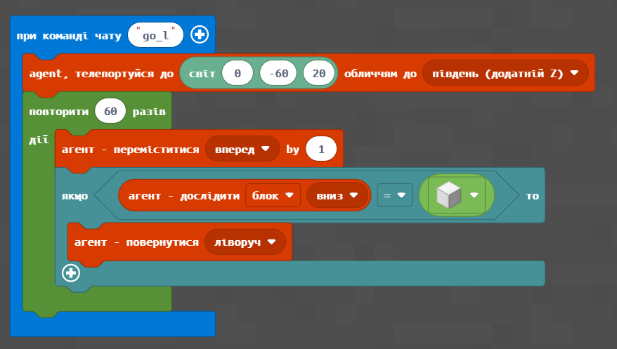
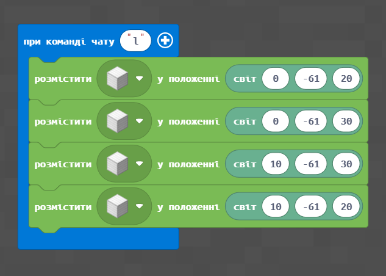
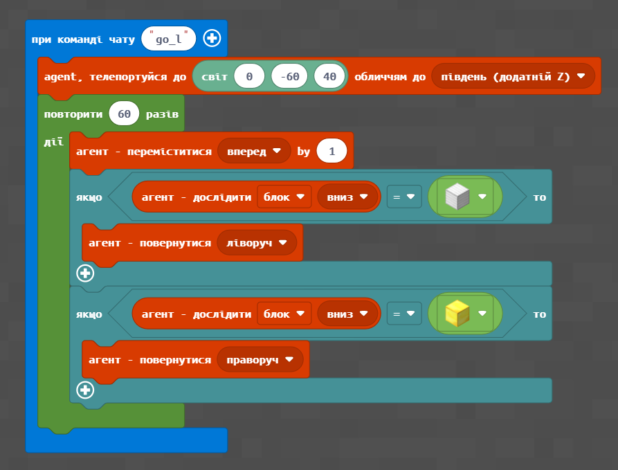
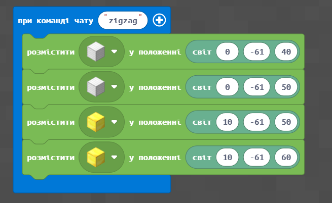
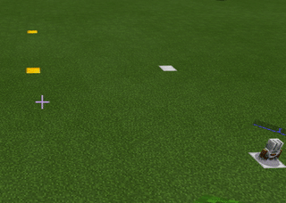
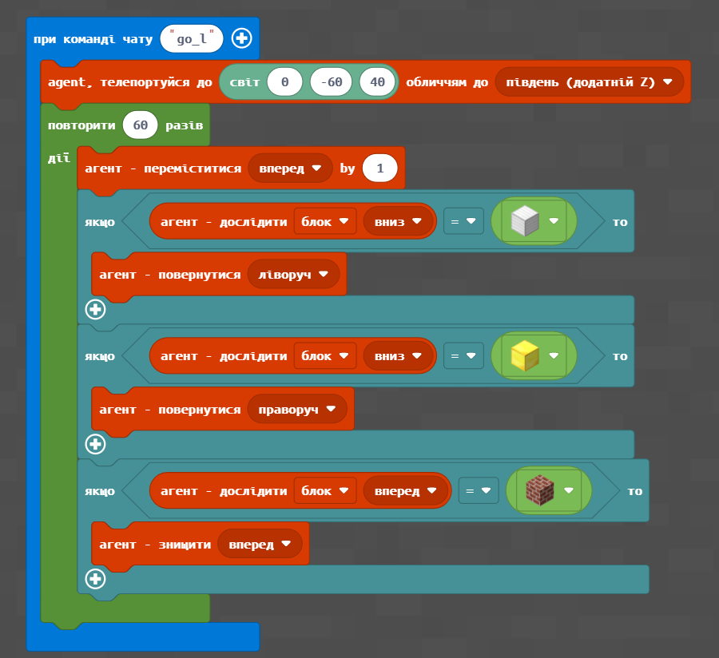
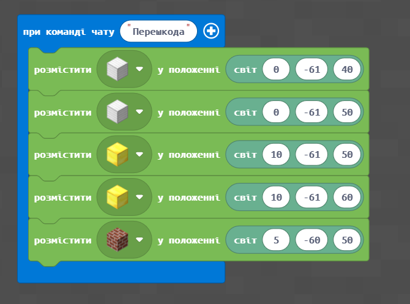
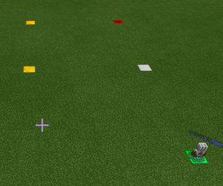

# Проходи по лабіринту

#### Опис


Ми продовжуємо нашу подорож по Стародавній Греції! Сьогодні створимо певні правила та керуючі сигнали, що підкажуть, як пройти по лабіринту


## Згадаймо🤔

1. Де краще робити схему лабіринту?&#x20;
2. Що таке рефакторінг?&#x20;

## Сьогодні ми:

1. Створимо розстановку покажчиків за допомогою агента
2. Зупинимо агента в певній точці (зупинимо виконання циклу)
3. Додамо функцію для агенту, щоб при кожному кроці він ставив знизу себе пил редстоуну

> **Усі ці навички обов'язково знадобляться під час виконання вашого проєкту!**😉

## Основні завдання


Для того, щоб пройти лабіринт, необхідно сформулювати певні правила та керуючі сигнали. Ми використаємо показчики на землі (певні блоки, які агент повертає ліворуч або праворуч, коли проходить їх).


### Управління переходом

#### Розстановка покажчиків. Поворот вліво

Найпростішим для розуміння керуванням пересування агента буде розстановка покажчиків: зустрічаюючи один тип блоків, агент повертає вліво, другий — вправо, третій — повертається та йде назад.

Перший функціонал, який ми надамо для нашого агента, - це навчити повертати вліво, якщо агент проходить над срібним блоком.

<figure><figcaption></figcaption></figure>

<table data-header-hidden><thead><tr><th width="165.57040661211687"></th><th width="393"></th></tr></thead><tbody><tr><td><strong>№</strong></td><td><strong>1</strong></td></tr><tr><td><strong>Завдання</strong></td><td><ol><li>Запустити рух по квдрату <strong>10*10</strong>, починаючи з точки <strong>(0;-60;20)</strong>, обличчям на південь, за допомогою срібних блоків запустить рух агента по точках <strong>(0;-60;20),(0;-60;30),(10;-60;30),(10;-60;20)</strong> Розставте срібні блоки (0;-61;0) до точки (1;-61;30)</li><li>Запустити рух по квадрату <strong>5*5</strong> починаючи з точки <strong>(0;-60;40)</strong>, обличчям на південь, за допомогою срібних блоків запустить рух агента по точках <strong>(0;-60;40),(0;-60;45),(5;-60;45),(5;-60;40)</strong></li></ol></td></tr><tr><td><strong>Код</strong></td><td> </td></tr><tr><td><strong>Результат</strong></td><td> </td></tr></tbody></table>

### Розстановка покажчиків. Поворот вправо

Додамо для агента функціонал, щоб він при проходженні над золотим блоком повертав направо.

<figure><figcaption></figcaption></figure>

<table data-header-hidden><thead><tr><th width="165.57040661211687"></th><th width="393"></th></tr></thead><tbody><tr><td><strong>№</strong></td><td>2</td></tr><tr><td><strong>Завдання</strong></td><td><ol><li>Запустіть зигзаг із кроком <strong>10 блоків</strong>, починаючи з точки <strong>(0;-60;40)</strong> за схемою вперед-вліво-вперед-вправо-вперед-вправо-вперед через точки <strong>(0;-60;40), (0;-60;50), (10;-60;50), (0;-60;60).</strong></li><li>Запустіть зигзаг із кроком <strong>5 блоків</strong>, починаючи із точки <strong>(0;-60;80)</strong> за схемою вперед-вліво-вперед-вправо-вперед-вправо-вперед через точки <strong>(0;-60;80), (0;-60;85), (5;-60;85), (0;-60;85).</strong></li></ol></td></tr><tr><td><strong>Код</strong></td><td> </td></tr><tr><td><strong>Результат</strong></td><td> </td></tr></tbody></table>

##

### Розстановка перешкод

Додамо для агента функціонал, щоб він при появі перешкоди перед собою знищував її

<figure><figcaption></figcaption></figure>

<table><thead><tr><th width="255"></th><th></th></tr></thead><tbody><tr><td><strong>№:</strong></td><td>3</td></tr><tr><td>Завдання:</td><td><ol><li>Запустіть зигзаг із кроком <strong>10 блоків</strong>, починаючи з точки <strong>(0;-60;40)</strong> за схемою вперед-вліво-вперед-вправо-вперед-вправо-вперед через точки <strong>(0;-60;40), (0;-60;50), (10;-60;50), (0;-60;60)</strong> і додайте перешкоду в точці <strong>(5;-60;50)</strong> з цегляного блоку.</li><li>Запустити рух по квадрату <strong>5*5</strong> починаючи з точки <strong>(0;-60;40)</strong>, обличчям на південь, за допомогою срібних блоків запустить рух агента по точках <strong>(0;-60;40),(0;-60;45),(5;-60;45),(5;-60;40)</strong> і додайте дві перешкоди в довільній точці</li></ol></td></tr><tr><td>Код:</td><td> </td></tr><tr><td>Результат:</td><td></td></tr></tbody></table>

### Створення умови для завершення гри


У попередніх двох прикладах ми використовували для переміщення агенту цикл із визначеною кількістю повторювань. Такий цикл залежить лише від кількості повторювань.&#x20;

Для того, щоб можна було зупинити агента в певній точці, необхідно мати можливість зупинити виконання циклу. Для цього ми використаємо цикл, що виконується доти, доки певна умова має значення «істина».


<figure><figcaption></figcaption></figure>

<table data-header-hidden><thead><tr><th width="165.57040661211687"></th><th width="393"></th></tr></thead><tbody><tr><td><strong>№</strong></td><td><strong>1</strong></td></tr><tr><td><strong>Завдання</strong></td><td><ol><li>Запустіть зигзаг із кроком 10 блоків, починаючи із точки <strong>(0;-60;40)</strong> за схемою вперед-вліво-вперед-вправо-вперед-вправо-вперед через точки <strong>(0;-60;40), (0;-60;50), (10;-60;50), (0;-60;60)</strong>. Із зупинкою в точці <strong>(0;-60;60)</strong>.</li><li>Запустіть зигзаг із кроком 5 блоків, починаючи із точки <strong>(0;-60;80)</strong> за схемою вперед-вліво-вперед-вправо-вперед-вправо-вперед через точки <strong>(0;-60;80), (0;-60;85), (5;-60;85), (0;-60;85</strong>). Із зупинкою в точці <strong>(0;-60;85)</strong>.</li></ol>

</td></tr><tr><td><strong>Код</strong></td><td>

</td></tr><tr><td><strong>Результат</strong></td><td> </td></tr></tbody></table>


На наступному занятті ми продовжимо подорож Стародавньою Грецією, і ви отримаєте навички, які стануть в нагоді під час виконання вашого проєкту😉

